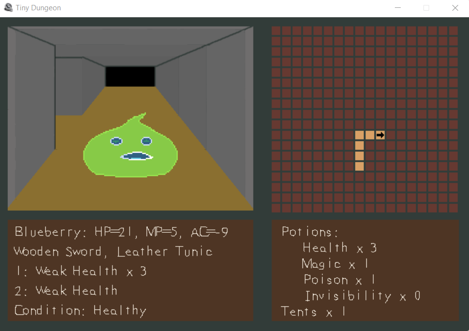

<p align="center">
  <a href="https://www.objeck.org"></a>
</p>

<p align="center">
  <a href="https://github.com/objeck/objeck-lang/actions/workflows/c-cpp.yml"></a>
  <a href="https://discord.gg/qEaCGWR7nb"></a>
  <a href="https://scan.coverity.com/projects/objeck"></a>
</p>

<h1 align="center">Intuitive, Fast & Efficient</h1>

```ruby
class Hello {
   function : Main(args : String[]) ~ Nil {
      hiya := Collection.Vector->New()<String>
      hiya->AddBack("Hello World")
      hiya->AddBack("Καλημέρα κόσμε")
      hiya->AddBack("こんにちは 世界")
      hiya->Each(\^(h) => h->PrintLine())
   }
}
```

To get started, take a look at the [language guide](https://objeck.org/getting_started.html) and [code examples](https://github.com/objeck/objeck-lang/tree/master/programs/examples). If you want to contribute, start with the [system architecture](https://github.com/objeck/objeck-lang/tree/master/core).

## Key Features
* Modern object-oriented and functional
* Cross-platform: Linux (x64 and ARM64), macOS (ARM64), Windows (x64)
* Optimized and JIT-compiled runtime
* API support for
  * Secure web servers and clients
  * Encryption
  * Native parsing of JSON, CSV, and XML
  * Regular expressions
  * 2D gaming framework and matrix mathematics APIs
  * Basics such as: files, directories, sockets, STDIO, logging, serialization, and pipe
* REPL and IDE [LSP](https://github.com/objeck/objeck-lsp) support (for VSCode, Sublime, Kate, etc.) 
* Online guides and API [documentation](https://www.objeck.org).

### [Object-oriented](https://en.wikipedia.org/wiki/Object-oriented_programming)
  
#### Inheritance
```ruby
class Triangle from Shape {
  New() {
    Parent();
  }
}
```

#### Interfaces
```ruby
class Triangle from Shape implements Color {
  New() {
    Parent();
  }

  method : public : GetRgb() ~ Int {
    return 0xadd8e6;
  }
}

interface Color {
  method : virtual : public : GetRgb() ~ Int;
}
```

#### Type Inference
```ruby
value := "Hello World!";
value->Size()->PrintLine();
```

#### Anonymous Classes
```ruby
interface Greetings {
  method : virtual : public : SayHi() ~ Nil;
}

class Hello {
  function : Main(args : String[]) ~ Nil {
    hey := Base->New() implements Greetings {
      New() {}

      method : public : SayHi() ~ Nil {
        "Hey..."->PrintLine();
      }
    };
}
```

#### Reflection
```ruby
klass := "Hello World!"->GetClass();
klass->GetName()->PrintLine();
klass->GetMethodNumber()->PrintLine();
```

#### Dependency Injection
```ruby
value := Class->Instance("System.String")->As(String);
value += "510";
value->PrintLine();
```
#### Generics
```ruby
map := Collection.Map->New()<IntRef, String>;
map->Insert(415, "San Francisco");
map->Insert(510, "Oakland");
map->Insert(925, "East Bay");
map->ToString()->PrintLine();
```

#### Type Boxing
```ruby
list := Collection.List->New()<IntRef>;
list->AddBack(17);
list->AddFront(4);
(list->Back() + list->Front())->PrintLine();
```

#### Static import
```ruby
use function Int;

class Test {
  function : Main(args : String[]) ~ Nil {
    Abs(-256)->Sqrt()->PrintLine();
  }
}
```

#### Serialization
```ruby
serializer := System.IO.Serializer->New();
serializer->Write(map);
serializer->Write("Fin.");
bytes := serializer->Serialize();
bytes->Size()->PrintLine();
```

### [Functional](https://en.wikipedia.org/wiki/Functional_programming)
#### Closures and Lambda Expressions
```ruby
funcs := Vector->New()<FuncRef<IntRef>>;
each(i : 10) {
  funcs->AddBack(FuncRef->New(\() ~ IntRef : () 
    => System.Math.Routine->Factorial(i) * funcs->Size())<IntRef>);
};

each(i : funcs) {
  value := funcs->Get(i)<FuncRef>;
  func := value->Get();
  func()->Get()->PrintLine();
};
```

#### First-Class Functions
```ruby
@f : static : (Int) ~ Int;
@g : static : (Int) ~ Int;

function : Main(args : String[]) ~ Nil {
  compose := Composer(F(Int) ~ Int, G(Int) ~ Int);
  compose(13)->PrintLine();
}

function : F(a : Int) ~ Int {
  return a + 14;
}

function : G(a : Int) ~ Int {
  return a + 15;
}

function : native : Compose(x : Int) ~ Int {
  return @f(@g(x));
}

function : Composer(f : (Int) ~ Int, g : (Int) ~ Int) ~ (Int) ~ Int {
  @f := f;
  @g := g;
  return Compose(Int) ~ Int;
}
```

### Host Support
#### Unicode
```ruby
"Καλημέρα κόσμε"->PrintLine();
```

#### File System
```ruby
content := Sytem.IO.Filesystem.FileReader->ReadFile(filename);
content->Size()->PrintLine();
Sytem.IO.Filesystem.File->Size(filename)->PrintLine();
```

#### Sockets
```ruby
socket->WriteString("GET / HTTP/1.1\nHost:google.com\nUser Agent: Mozilla/5.0 (compatible)\nConnection: Close\n\n");
line := socket->ReadString();
while(line <> Nil & line->Size() > 0) {
  line->PrintLine();  
  line := socket->ReadString();
};
socket->Close();
```

#### Named Pipes
```ruby
pipe := System.IO.Pipe->New("foobar", Pipe->Mode->CREATE);
if(pipe->Connect()) {
  pipe->ReadLine()->PrintLine();
  pipe->WriteString("Hi Ya!");
  pipe->Close();
};
```

#### Threads
```ruby
class CaculateThread from Thread {
  ...
  @inc_mutex : static : ThreadMutex;

  New() {
    @inc_mutex := ThreadMutex->New("inc_mutex");
  }
  
  method : public : Run(param : System.Base) ~ Nil {
    Compute();
  }

  method : native : Compute() ~ Nil {
    y : Int;

    while(true) {
      critical(@inc_mutex) {
        y := @current_line;
        @current_line+=1;
      };
      ...
    };
  }
}
```
#### Date/Times
```ruby
yesterday := System.Time.Date->New();
yesterday->AddDays(-1);
yesterday->ToString()->PrintLine();
```

### Libraries
  * [HTTPS](https://github.com/objeck/objeck-lang/blob/master/core/compiler/lib_src/net_secure.obs) and [HTTP](https://github.com/objeck/objeck-lang/blob/master/core/compiler/lib_src/net.obs) server and client APIs
  * [JSON](https://github.com/objeck/objeck-lang/blob/master/core/compiler/lib_src/json.obs), [XML](https://github.com/objeck/objeck-lang/blob/master/core/compiler/lib_src/xml.obs) and [CSV](https://github.com/objeck/objeck-lang/blob/master/core/compiler/lib_src/csv.obs) parsers
  * [Regular expression](https://github.com/objeck/objeck-lang/blob/master/core/compiler/lib_src/regex.obs) library
  * Encryption and hashing
  * In memory [query framework](https://github.com/objeck/objeck-lang/blob/master/core/compiler/lib_src/query.obs) with SQL-like syntax
  * Database access
  * [2D Gaming framework](https://github.com/objeck/objeck-lang/blob/master/core/compiler/lib_src/sdl_game.obs) via SDL2
  * [Collections](https://github.com/objeck/objeck-lang/blob/master/core/compiler/lib_src/gen_collect.obs) (caches, vectors, queues, trees, hashes, etc.)
  * GTK windowing support [(work-in-progress)](core/lib/experimental/gtk)

### System
* Native extension libraries (.so, .dll)
* [Generational garbage collection](https://en.wikipedia.org/wiki/Tracing_garbage_collection)
* [JIT compilation](https://en.wikipedia.org/wiki/Just-in-time_compilation)
  * [arm64](https://github.com/objeck/objeck-lang/tree/master/core/vm/arch/jit/arm64): Linux (Raspberry Pi 4), macOS (Apple silicon)
  * [x86-64](https://github.com/objeck/objeck-lang/tree/master/core/vm/arch/jit/amd64): Windows (10/11), Linux and macOS
* [LSP](https://github.com/objeck/objeck-lsp) support for text editors
* Documentation
  * [Tutorial](https://www.objeck.org/getting_started.html)
  * [APIs](https://www.objeck.org/doc/api/index.html)

## Screenshots
| <sub>[VS Code](https://github.com/objeck/objeck-lsp)</sub> | <sub>[Debugger](https://github.com/objeck/objeck-lang/tree/master/core/debugger)</sub> | <sub>[Dungeon Crawler](https://github.com/objeck/objeck-dungeon-crawler)</sub> | <sub>[Platformer](https://github.com/objeck/objeck-lang/blob/master/programs/deploy/2d_game_13.obs)</sub> | <sub>[Windows Utility](https://github.com/objeck/objeck-lang/tree/master/core/release/WindowsLauncher)</sub> |
| :---: | :----: | :---: | :---: | :---: |
 |  |  |  |  |
