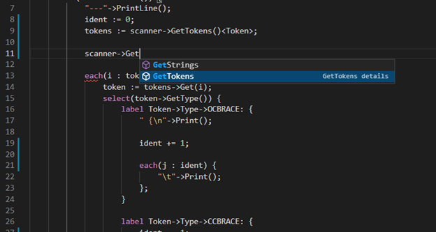
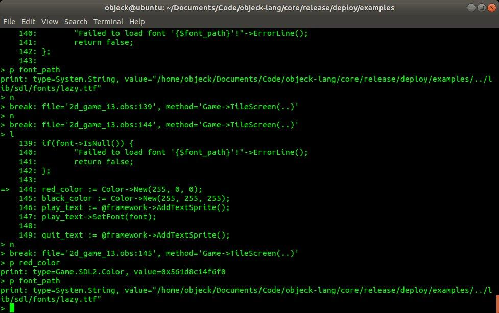

# Objeck

[](https://discord.gg/uPBqjWSW)
[](https://sourceforge.net/projects/objeck-lang/)
[](https://github.com/objeck/objeck-lang/actions/workflows/c-cpp.yml)
[](https://scan.coverity.com/projects/objeck)

Objeck is an object-oriented programming language with functional features. Objeck emphasizes, expression, simplicity, portability, and scalability. The programming environment consists of a compiler, virtual machine, and command line debugger with IDE [plugins](https://github.com/objeck/objeck-lsp).

```ruby
class Hello {
  function : Main(args : String[]) ~ Nil {
    "Hello World" → PrintLine();
    "Καλημέρα κόσμε" → PrintLine();
    "こんにちは 世界" → PrintLine();
  }
}
```

| [Visual Studio Code](https://github.com/objeck/objeck-lsp) | [Debugger](https://github.com/objeck/objeck-lang/tree/master/core/debugger) | [Dungeon Crawler](https://github.com/objeck/objeck-dungeon-crawler) | [Platformer](https://github.com/objeck/objeck-lang/blob/master/programs/deploy/2d_game_13.obs) | [Windows Utility](https://github.com/objeck/objeck-lang/tree/master/core/release/WindowsLauncher) |
| :---: | :----: | :---: | :---: | :---: | 
 |  |  |  |  |

See more on [Rosetta Code](http://rosettacode.org/wiki/Category:Objeck) and checkout the following [programming tasks](programs/rc).

Notable features:
* Object-oriented with functional features
  * Classes, interfaces and first-class functions
  * Generics with type boxing
  * Anonymous classes 
  * Reflection 
  * Object serialization 
  * Type inference
  * Lambda expressions
  * Closures
* Libraries 
  * [Collections](https://github.com/objeck/objeck-lang/blob/master/core/compiler/lib_src/gen_collect.obs) (vectors, queues, trees, hashes, etc.)
  * [HTTP and HTTPS](https://github.com/objeck/objeck-lang/blob/master/core/compiler/lib_src/net.obs) client and SSL server support
  * [RegEx](https://github.com/objeck/objeck-lang/blob/master/core/compiler/lib_src/regex.obs)
  * [JSON](https://github.com/objeck/objeck-lang/blob/master/core/compiler/lib_src/json.obs), [XML](https://github.com/objeck/objeck-lang/blob/master/core/compiler/lib_src/xml.obs) and [CSV](https://github.com/objeck/objeck-lang/blob/master/core/compiler/lib_src/csv.obs) parsers
  * Encryption
  * Database access
  * [Query framework](https://github.com/objeck/objeck-lang/blob/master/core/compiler/lib_src/query.obs)
  * [2D Gaming framework](https://github.com/objeck/objeck-lang/blob/master/core/compiler/lib_src/sdl_game.obs)
* Native support for threads, sockets, files, date/time, etc.
* Garbage collection
* JIT support for all targets
  * arm64: Linux, macOS
  * x64: Linux, macOS and Windows

## Documentation
Please refer to the programmer's guide [documentation](https://www.objeck.org/doc/api/index.html) and [online tutorial](https://www.objeck.org/getting_started.html). Also checkout [Rosetta Code](http://rosettacode.org/wiki/Category:Objeck) [examples](programs/rc).

## Architecture
* [Compiler](https://github.com/objeck/objeck-lang/blob/master/core/compiler)
* [Virtual Machine](https://github.com/objeck/objeck-lang/blob/master/core/vm)
* [Debugger](https://github.com/objeck/objeck-lang/blob/master/core/debugger)
* [Memory manager](https://github.com/objeck/objeck-lang/blob/master/core/vm/arch)
* [Just-In-Time (JIT) compilers](https://github.com/objeck/objeck-lang/blob/master/core/vm/arch/jit)


Building on Linux and macOS:
*  Install required libraries: <code>sudo apt-get install build-essential git libssl-dev unixodbc-dev libsdl2-dev libsdl2-image-dev libsdl2-ttf-dev libsdl2-mixer-dev libreadline-dev unzip</code>
*  cd to <code>objeck-lang/core/release</code> and run <code>./deploy_posix.sh</code> with the parameter <code>64</code> or <code>osx</code> representing the bit version of Linux
*  Build output with binaries and documentation will be located in <code>objeck-lang/core/release/deploy</code>
*  Reference <code>objeck-lang/core/release/deploy/readme.html</code> to set paths and find examples

Building on Windows:
*  With Visual Studio 2022 or later open <code>objeck-lang/care/release/objeck.sln</code>
*  Ensure build completes successfully (in Release mode)
*  To build everything, cd to <code>objeck-lang/care/release</code> and run <code>deploy_amd64.cmd deploy</code>
*  Build output with binaries and documentation will be located in <code>objeck-lang/core/release/deploy64</code>
*  Reference <code>objeck-lang/core/release/deploy64/readme.html</code> to set paths and find examples
