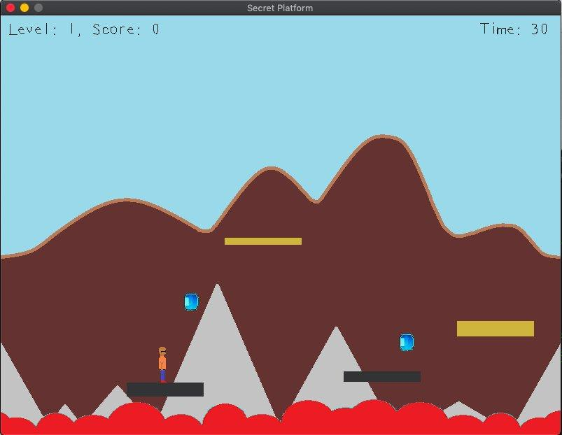

<p align="center">
  <a href="https://www.objeck.org"></a>
</p>

<p align="center">
  <a href="https://github.com/objeck/objeck-lang/actions/workflows/c-cpp.yml"></a>
  <a href="https://discord.gg/qEaCGWR7nb"></a>
  <a href="https://scan.coverity.com/projects/objeck"></a>
</p>

<h1 align="center">Fully Programmable</h1>

```ruby
class Hello {
   function : Main(args : String[]) ~ Nil {
      hiya := Collection.Vector->New()<String>
      hiya->AddBack("Hello World")
      hiya->AddBack("Καλημέρα κόσμε")
      hiya->AddBack("こんにちは 世界")
      hiya->Each(\^(h) => h->PrintLine())
   }
}
```

More Rosetta Code [examples](https://github.com/objeck/objeck-lang/tree/master/programs/tests/rc)

## Key Features
* Object-oriented
  * [Inheritance](https://en.wikipedia.org/wiki/Inheritance_(object-oriented_programming))
  * [Interfaces](https://en.wikipedia.org/wiki/Interface_(object-oriented_programming))
  * [Type Inference](https://en.wikipedia.org/wiki/Type_inference)
  * [Reflection](https://en.wikipedia.org/wiki/Reflective_programming)
  * [Dependency injection](https://en.wikipedia.org/wiki/Dependency_injection)
  * [Generics](https://en.wikipedia.org/wiki/Generic_programming)
  * [Type boxing](https://en.wikipedia.org/wiki/Boxing_(computer_science))
  * [Serialization](https://en.wikipedia.org/wiki/Serialization)
* Functional 
  * [Closures](https://en.wikipedia.org/wiki/Closure_(computer_programming))
  * [Lambda expressions](https://en.wikipedia.org/wiki/Anonymous_function)
  * [First-class functions](https://en.wikipedia.org/wiki/First-class_function)
* [Unicode support](https://en.wikipedia.org/wiki/Unicode)
* OS-level support for 
  * [File systems](https://en.wikipedia.org/wiki/File_system)
  * [Sockets](https://en.wikipedia.org/wiki/Network_socket)
  * [Named pipes](https://en.wikipedia.org/wiki/Named_pipe)
  * [Threads](https://en.wikipedia.org/wiki/Thread_(computing))
  * [Date/times](https://en.wikipedia.org/wiki/C_date_and_time_functions#time_t)
  * [Extension libraries](https://en.wikipedia.org/wiki/Library_(computing))
* [Garbage collection](https://en.wikipedia.org/wiki/Tracing_garbage_collection)
* [JIT compilation](https://en.wikipedia.org/wiki/Just-in-time_compilation)
  * [arm64](https://github.com/objeck/objeck-lang/tree/master/core/vm/arch/jit/arm64): Linux (Raspberry Pi 4), macOS (Apple silicon)
  * [x86-64](https://github.com/objeck/objeck-lang/tree/master/core/vm/arch/jit/amd64): Windows 10/11, Linux and macOS
* Documentation
  * [Tutorial](https://www.objeck.org/getting_started.html)
  * [APIs](https://www.objeck.org/doc/api/index.html)

## Screenshots
| <sub>[VS Code](https://github.com/objeck/objeck-lsp)</sub> | <sub>[Debugger](https://github.com/objeck/objeck-lang/tree/master/core/debugger)</sub> | <sub>[Dungeon Crawler](https://github.com/objeck/objeck-dungeon-crawler)</sub> | <sub>[Platformer](https://github.com/objeck/objeck-lang/blob/master/programs/deploy/2d_game_13.obs)</sub> | <sub>[Windows Utility](https://github.com/objeck/objeck-lang/tree/master/core/release/WindowsLauncher)</sub> |
| :---: | :----: | :---: | :---: | :---: |
 |  |  |  |  |

## Libraries
  * [HTTPS](https://github.com/objeck/objeck-lang/blob/master/core/compiler/lib_src/net_secure.obs) and [HTTP](https://github.com/objeck/objeck-lang/blob/master/core/compiler/lib_src/net.obs) server and client APIs
  * [JSON](https://github.com/objeck/objeck-lang/blob/master/core/compiler/lib_src/json.obs), [XML](https://github.com/objeck/objeck-lang/blob/master/core/compiler/lib_src/xml.obs) and [CSV](https://github.com/objeck/objeck-lang/blob/master/core/compiler/lib_src/csv.obs) parsers
  * [Regular expression](https://github.com/objeck/objeck-lang/blob/master/core/compiler/lib_src/regex.obs) library
  * Encryption and hashing
  * In memory [query framework](https://github.com/objeck/objeck-lang/blob/master/core/compiler/lib_src/query.obs) with SQL-like syntax
  * Database access
  * [2D Gaming framework](https://github.com/objeck/objeck-lang/blob/master/core/compiler/lib_src/sdl_game.obs) via SDL2
  * [Collections](https://github.com/objeck/objeck-lang/blob/master/core/compiler/lib_src/gen_collect.obs) (caches, vectors, queues, trees, hashes, etc.)
  * GTK windowing support [(work-in-progress)](core/lib/experimental/gtk)

## Component Model


### Notable Subsystems
* [Compiler](https://github.com/objeck/objeck-lang/blob/master/core/compiler)
* [Virtual Machine](https://github.com/objeck/objeck-lang/blob/master/core/vm)
* [Debugger](https://github.com/objeck/objeck-lang/blob/master/core/debugger)
* [Memory manager](https://github.com/objeck/objeck-lang/blob/master/core/vm/arch)
* [Just-In-Time (JIT) compilation](https://github.com/objeck/objeck-lang/blob/master/core/vm/arch/jit)

## Working with the Code
Objeck can be built for a variety of targets. The language is implemented in C++, assembly (i.e., generated machine code) and assisted by code generators for bindings to SDL2 and GTK 3/4.

### Linux (x64, ARM64)
*  For Linux, install required libraries: <code>sudo apt-get install build-essential git libssl-dev unixodbc-dev libsdl2-dev libsdl2-image-dev libsdl2-ttf-dev libsdl2-mixer-dev libreadline-dev unzip</code>
*  cd to <code>objeck-lang/core/release</code> and run <code>./deploy_posix.sh</code> with the parameter <code>64</code> or <code>rpi</code> for x64 or ARM64 Linux
*  Build output with binaries and documentation will be located in <code>objeck-lang/core/release/deploy</code>
*  Reference <code>objeck-lang/core/release/deploy/readme.html</code> to set additional paths and find examples

### macOS (Apple Silicon)
*  Install Xcode with command line tools
*  Open a command shell and go to <code>objeck-lang/core/release</code> and run <code>./deploy_macos_arm64.sh</code>
*  Build output with binaries and documentation will be located in <code>objeck-lang/core/release/deploy</code>
*  Reference <code>objeck-lang/core/release/deploy/readme.html</code> to set additional paths and find examples

### Windows (Visual Studio)
*  Unzip the OpenSSL Windows libraries in <code>objeck-lang/core/lib/openssl/win/x64</code>
*  Using Visual Studio 2022 or later open <code>objeck-lang/core/release/objeck.sln</code>
*  Ensure the core build completes successfully (in Release mode)
*  To build everything, open a Visual Studio x64 command prompt and go to <code>objeck-lang/core/release</code> directory and run <code>deploy_amd64.cmd</code>
*  Build output with binaries and documentation will be located in <code>objeck-lang/core/release/deploy64</code>
*  Reference <code>objeck-lang/core/release/deploy64/readme.html</code> to learn how to set the environment variables and find code examples

### Windows (MSYS2)
* Under the UCRT64 (Unicode shell support)
  * Package dependencies
  * <code>pacman --noconfirm -S mingw-w64-ucrt-x86_64-gcc mingw-w64-ucrt-x86_64-openssl make mingw-w64-ucrt-x86_64-SDL2 unzip mingw-w64-ucrt-x86_64-SDL2_ttf mingw-w64-ucrt-x86_64-SDL2_mixer mingw-w64-ucrt-x86_64-SDL2_image mingw-w64-ucrt-x86_64-unixodbc</code>
  * cd to <code>objeck-lang/core/release</code> and run <code>./deploy_msys2-ucrt.sh</code>
  *  Build output with binaries and documentation will be located in <code>objeck-lang/core/release/deploy-msys2-ucrt</code>
  *  Set the path for to the UCRT64 'bin' directory
  *  Reference <code>objeck-lang/core/release/deploy-msys2-ucrt/readme.html</code> to set additional paths and find examples
* Under the Clang64
  * Package dependencies
  * <code>pacman --noconfirm -S mingw-w64-clang-x86_64-gcc mingw-w64-clang-x86_64-openssl make mingw-w64-clang-x86_64-SDL2 unzip mingw-w64-clang-x86_64-SDL2_ttf mingw-w64-clang-x86_64-SDL2_mixer mingw-w64-clang-x86_64-SDL2_image mingw-w64-clang-x86_64-unixodbc</code>
  * cd to <code>objeck-lang/core/release</code> and run <code>./deploy_msys2-clang.sh</code>
  *  Build output with binaries and documentation will be located in <code>objeck-lang/core/release/deploy-msys2-clang</code>
  *  Set the path for to the Clang64 'bin' directory
  *  Reference <code>objeck-lang/core/release/deploy-msys2-clang/readme.html</code> to set additional paths and find examples
